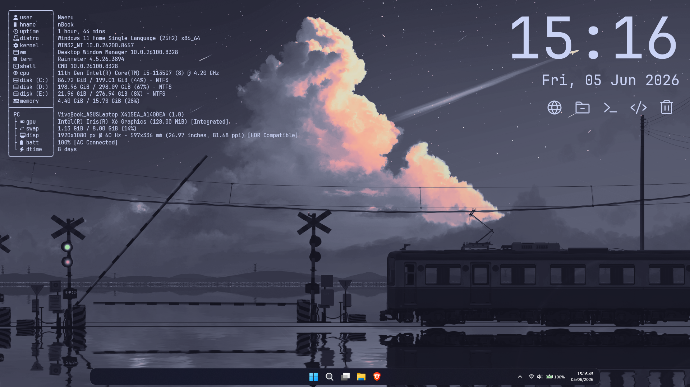

# Amartha

A simple, no-nonsense Rainmeter skin designed to be as lightweight and beautiful as possible.



## Features

- A lightweight, Fastfetch-based system profile. Kudos to IvyProtocol for [the config!](https://github.com/fastfetch-cli/fastfetch/discussions/971#discussioncomment-15719882) 
- A simple clock showing time and date.
- A beautiful app dock with minimal icons from [Phosphor Icons](https://phosphoricons.com/). By default they open the default browser, File Explorer, Windows Terminal, VS Code, and Recycle Bin respectively. Can be edited by modifying `Dock.ini`.

## Installation

- Clone or download this repo as ZIP. Extract the contents in your Rainmeter skins folder.

- Install [Fastfetch](https://github.com/fastfetch-cli/fastfetch). Preferably with the winget method.
  ```powershell
  winget install fastfetch
  ```

- Generate initial Fastfetch config.
  ```powershell
  fastfetch --gen-config
  ```
  Note the config file location printed. The location is usually in `%USERPROFILE%\.config\fastfetch\config.jsonc`

- Go to that location, and replace the exisiting config file with a copy of [`config.jsonc`](./config.jsonc) from this repo (Optional: you can use the default or your own config). PS: if the location is different, you may need to adjust the `FastfetchConfigPath` inside [`Variables.inc`](@Resources/Variables.inc).

- Install a nerd font. The default is [JetBrainsMonoNL Nerd Font](https://github.com/ryanoasis/nerd-fonts/releases/download/v3.4.0/JetBrainsMono.zip). If you use different font, please change that in [`Variables.inc`](@Resources/Variables.inc) too.

- Apply and enjoy!

## Bonus (if you want the exact same desktop as me)

- Hide desktop icons.
- Use this wallpaper: [train-sideview](https://github.com/orangci/walls-catppuccin-mocha/blob/master/train-sideview.png)
- Taskbar: Install [Windhawk](https://windhawk.net/) and Windows 11 Taskbar Styler, use the built-in [Luminosity (Dock)](https://github.com/ramensoftware/windows-11-taskbar-styling-guide/blob/main/Themes/Luminosity/README.md) config.
